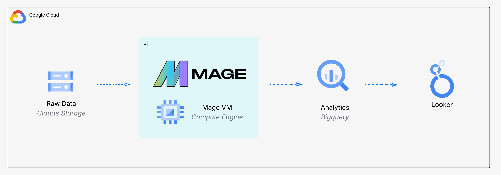
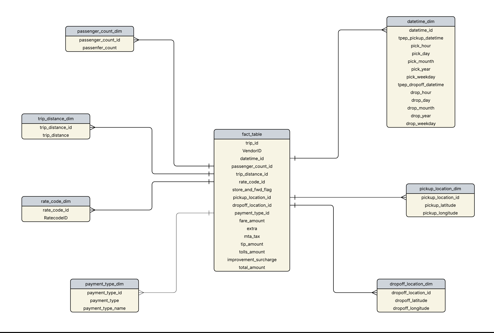

# Uber Data Analytics | Modern Data Engineering on GCP

A comprehensive end-to-end data engineering project demonstrating modern ETL practices using Uber trip data, cloud infrastructure, and advanced analytics tools.

## 📊 Project Overview

This project showcases a complete data engineering pipeline that ingests, transforms, and analyzes Uber trip data using industry-standard tools and Google Cloud Platform services. The pipeline enables scalable data processing and interactive visualization for business intelligence insights.

## 🏗️ Architecture



The architecture follows a modern data engineering pattern:
- **Data Ingestion**: Raw data stored in Google Cloud Storage
- **Orchestration**: Mage.ai handles ETL workflow automation
- **Processing**: Python-based transformations on GCP Compute Engine
- **Data Warehouse**: BigQuery for analytics and querying
- **Visualization**: Looker Studio for interactive dashboards

## 🛠️ Technology Stack

### Programming & Scripting
- **Python**: Data transformation and processing logic

### Google Cloud Platform
1. **Cloud Storage**: Scalable object storage for raw data
2. **Compute Engine**: Virtual machines for running data pipelines
3. **BigQuery**: Serverless data warehouse for analytics
4. **Looker Studio**: Business intelligence and visualization

### Data Pipeline Tool
- **Mage AI**: Modern data pipeline orchestration
  - [Official Website](https://www.mage.ai/)
  - [GitHub Repository](https://github.com/mage-ai/mage-ai)
  - Open source contributions welcome!

## 📐 Data Model



The data model follows a star schema design optimized for analytical queries, enabling efficient aggregations and dimensional analysis of Uber trip data.

## 🚀 Getting Started

### Prerequisites
- Google Cloud Platform account with billing enabled
- Python 3.8 or higher
- Basic knowledge of SQL and cloud computing

### Installation & Setup

1. **Clone the repository**
   ```bash
   git clone <repository-url>
   cd uber-data-analytics
   ```

2. **Set up GCP resources**
   - Create a GCP project
   - Enable required APIs (Storage, Compute Engine, BigQuery)
   - Set up service account with appropriate permissions

3. **Configure Mage.ai**
   - Install Mage on GCP Compute Instance
   - Configure data pipeline blocks
   - Set up connections to BigQuery

4. **Deploy the pipeline**
   - Upload raw data to Cloud Storage
   - Execute ETL workflows through Mage
   - Verify data in BigQuery

## 📈 Features

- **Automated ETL**: Scheduled data ingestion and transformation
- **Scalable Processing**: Cloud-native architecture handles growing data volumes
- **Interactive Dashboards**: Real-time analytics through Looker Studio
- **Cost-Effective**: Serverless components minimize infrastructure costs
- **Reproducible**: Infrastructure-as-code principles for consistent deployments

## 🤝 Contributing

Contributions are welcome! Feel free to:
- Report bugs and issues
- Suggest new features
- Submit pull requests
- Improve documentation

## 📝 License

This project is open source and available under the [MIT License](LICENSE).

## 🙏 Acknowledgments

- [Mage AI](https://www.mage.ai/) for the excellent open-source data pipeline tool
- Google Cloud Platform for robust cloud infrastructure
- The data engineering community for inspiration and best practices

---

**Note**: Replace placeholder images and repository URLs with your actual project resources.
